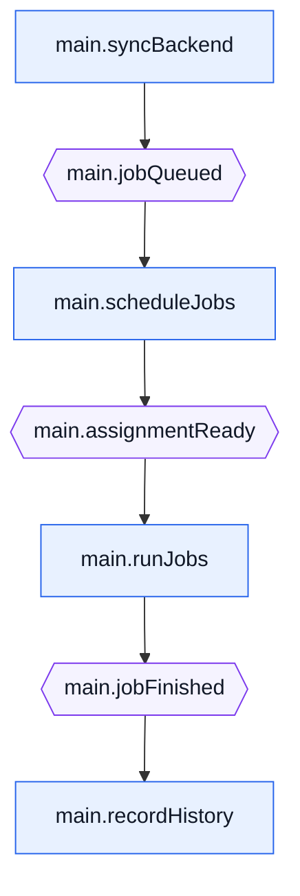

# backplane

[![CI][ci-badge]][ci]
[![Go Reference][reference-badge]][go-reference]
[![License: Apache-2.0][license-badge]][license]

A small in-process application runtime for Go. You write modules as ordinary
functions, and their signatures declare how they plug into the application:
resources they need, topics they publish or subscribe to, and the shared
lifecycle they run under. Backplane wires the modules together, runs them
concurrently, and can render the resulting topology — all from the same
declarations.

## Installation

```console
go get github.com/sunfish-robotics/backplane
```

```go
type jobQueued struct{ ID string }
type assignmentReady struct{ Job, Printer string }
type jobFinished struct{ Job string }

func syncBackend(ctx context.Context, store *jobStore, queued chan<- jobQueued) error {
	for _, id := range store.Queued() {
		queued <- jobQueued{ID: id}
	}
	return nil
}

func scheduleJobs(ctx context.Context, queued <-chan jobQueued, assignments chan<- assignmentReady) error {
	for job := range queued {
		assignments <- assignmentReady{Job: job.ID, Printer: "printer-1"}
	}
	return nil
}

func runJobs(ctx context.Context, assignments <-chan assignmentReady, finished chan<- jobFinished) error { … }
func recordHistory(ctx context.Context, finished <-chan jobFinished) error { … }

func main() {
	application, err := backplane.New(syncBackend, scheduleJobs, runJobs, recordHistory)
	if err != nil {
		log.Fatal(err)
	}

	// The caller owns resource construction and cleanup.
	store := openJobStore()
	defer store.Close()

	if err := application.Run(context.Background(), store); err != nil {
		log.Fatal(err)
	}
}
```

Each module is directly testable — call it with a context, a fake store, and
channels you control. Registration never executes module code, so the same
declarations also produce a top-to-bottom dataflow without opening a single
connection:

```go
fmt.Print(application.Graph().Mermaid())
```



Caller-provided resources are omitted from the default diagram so dependency
injection does not obscure the topic flow. `MermaidWith` can include them or
change the flowchart direction. `Include` narrows a graph to selected modules,
their output topics, and every transitive dependency that feeds them:

```go
focused, err := application.Graph().Include("scheduleJobs")
if err != nil {
	log.Fatal(err)
}
fmt.Print(focused.MermaidWith(backplane.MermaidOptions{Resources: true}))
```

## How wiring works

A module is any `func(ctx context.Context, ...dependencies) error`. Each
parameter after the context declares one dependency:

| Parameter type | Meaning |
| --- | --- |
| `chan<- T` | publish to the topic carrying `T` |
| `<-chan T` | subscribe to the topic carrying `T` |
| `*backplane.Latest[T]` | observe the most recent `T` without backpressuring the topic |
| anything else | a resource passed to `Run` by the caller |

Topics are identified by the exact Go type flowing through them. Any number of
modules can publish or subscribe to the same type; every subscriber receives
every value. Resources bind by exact type first, otherwise by unique
assignability, so a concrete value can satisfy an interface parameter. Nil,
duplicate, ambiguous, missing, and unused resources are all rejected before
any module starts.

## Lifecycle

`Run` starts every module under one [errgroup]: returning `nil` completes just
that module, the first error cancels every sibling's context, and cancelling
the context passed to `Run` shuts the whole application down. `Run` waits for
all modules to return. A module error takes precedence; otherwise it returns
the caller's context error, which is `nil` after natural completion.

A module may close a publisher channel when it has finished publishing. A
publisher completes when its channel is closed or its module returns, whichever
happens first. Once every publisher completes, Backplane closes the subscriber
channels, so `for value := range subscription` is the natural consumption loop.
Closing one publisher does not affect its peers. Don't close subscriber
channels, send after closing a publisher, or use any channel after returning.

[errgroup]: https://pkg.go.dev/golang.org/x/sync/errgroup

## Delivery semantics

Delivery is in-process, memory-only, and backpressured. The topic pump holds at
most one value in flight: a send returns when the pump accepts the value, which
may be before every subscriber accepts it, but the pump cannot accept another
publication while a slow subscriber blocks delivery. Treat every send as
potentially blocking. Cancellation may drop values that are in flight. There
is no durability, replay, retry, or acknowledgement — if work must survive a
crash, persist it first and use the topic as a wake-up.

`Latest[T]` is the explicit boundary between streams and state. It retains the
newest value and its arrival time; `Watch` gives dynamic consumers (an HTTP
handler, an SSE stream) latest-wins updates that may skip intermediate values
but can never stall the publishers.

Code outside the runtime can project a channel through the same constructor the
runtime uses:

```go
updates := make(chan printerState, 1)
latest := backplane.NewLatest((<-chan printerState)(updates))

updates <- printing
```

The caller owns `updates`: `NewLatest` reads it but never closes it. Closing the
channel projects any buffered values, retains the final one, and then closes all
watchers. The projection runs asynchronously, so a completed send or close is
not a read-after-write barrier for `Load`; wait for `Watch` when synchronisation
matters. Passing a nil channel panics. `Latest` itself deliberately has no
`Publish` or `Close` method, so passing it to a module does not also hand that
module control of the source.

Runtime-owned projections use a private one-value, latest-wins input so they do
not add backpressure to the topic. Topic completion waits for that input to be
drained, preserving the guarantee that `Load` sees the final accepted value
after `Run` returns.

## What backplane is not

- **Not a message broker** — no persistence, cross-process transport, or QoS.
- **Not a resource construction or lifecycle container** — the caller creates
  resources and cleans them up; backplane only binds already-created values.
- **Not a process manager** — the module set is fixed before startup. A module
  that needs dynamic workers spawns and joins its own goroutines.

## Stability

Backplane requires Go 1.25 or later. It is pre-1.0, so its public API may change
while it is validated in production applications.

## Licence

Apache-2.0. See [LICENSE](LICENSE).

[ci]: https://github.com/sunfish-robotics/backplane/actions/workflows/ci.yml
[ci-badge]: https://github.com/sunfish-robotics/backplane/actions/workflows/ci.yml/badge.svg
[go-reference]: https://pkg.go.dev/github.com/sunfish-robotics/backplane
[license]: LICENSE
[license-badge]: https://img.shields.io/badge/license-Apache--2.0-blue.svg
[reference-badge]: https://pkg.go.dev/badge/github.com/sunfish-robotics/backplane.svg
